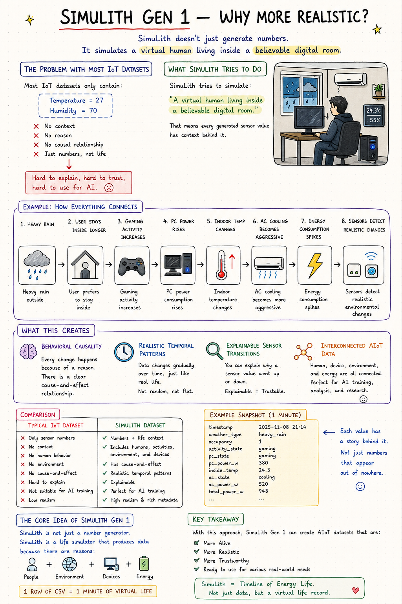
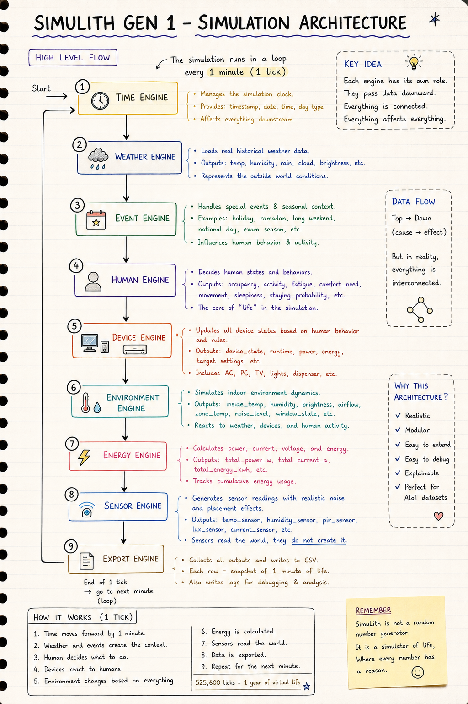

# SimuLith Gen-1

<p align="center">
  <strong>Behavioral AIoT Virtual Room Simulator</strong>
</p>

<p align="center">
  Simulating realistic smart-room behavior through contextual human activity, adaptive devices, environmental interaction, and imperfect IoT sensors.
</p>

SimuLith Gen-1 is a behavioral AIoT simulation system designed to generate realistic smart-room datasets using virtual human behavior, environmental physics, adaptive devices, and contextual events.

Instead of producing random sensor values, SimuLith simulates:

* human routines
* environmental changes
* device interaction
* energy consumption
* sensor imperfections
* contextual behavioral patterns

The result is a rich, explainable, and reusable dataset suitable for:

* AIoT research
* smart-home simulation
* anomaly detection
* occupancy prediction
* behavioral analysis
* energy forecasting
* edge AI experimentation

---

---

# Main Idea

<p align="center">
  
</p>

---

---

# Simulation Architecture

<p align="center">
  
</p>

<p align="center">
  Contextual behavioral simulation pipeline inside SimuLith Gen-1.
</p>

---

---

# What SimuLith Simulates

## Human Behavior

The virtual human is not random.

Behavior changes dynamically based on:

* time
* weather
* stress
* fatigue
* focus
* comfort
* financial pressure
* special days
* events

### Simulated Activities

* Sleeping
* Gaming
* Side Job
* Cooking
* Watching TV
* Relaxing
* Outside Working
* Morning Routine

---

## Dynamic Weather System

Weather affects:

* occupancy
* gaming probability
* room brightness
* comfort
* humidity
* AC usage

### Weather Types

* Sunny
* Cloudy
* Light Rain
* Heavy Rain

---

## Contextual Events

SimuLith includes contextual virtual-life events.

### Events

* Weekend Gaming
* Late Night Work
* Laundry Day

### Special Days

* Ramadan
* Lebaran
* New Year

These events influence:

* activity patterns
* occupancy
* energy usage
* sleep behavior
* device interaction

---

## Adaptive Device Logic

Devices react to:

* indoor conditions
* human comfort
* activities
* weather
* financial behavior

### Simulated Devices

* AC
* PC
* Main Lamp
* Desk Lamp
* TV
* Rice Cooker
* Washing Machine

---

## Environmental Physics

The environment engine simulates:

* indoor temperature
* humidity
* brightness
* heat transfer
* AC cooling effects
* PC heat generation

---

## Energy System

SimuLith calculates:

* total power consumption
* current
* voltage
* cumulative kWh

This enables:

* energy analytics
* smart-grid experiments
* AI forecasting
* occupancy estimation

---

## Realistic Sensor Layer

Sensors are intentionally imperfect.

### Features

* noise
* drift
* false positives
* imperfect readings

### Simulated Sensors

* temperature sensor
* humidity sensor
* PIR sensor
* lux sensor

This creates more realistic AI training data.

---

---

# Dataset Output

SimuLith exports contextual CSV datasets.

Example columns:

```text
activity
fatigue
stress
focus
comfort
inside_temp
humidity
power_consumption
occupancy
weather_type
special_day
sensor_values
```

The dataset is designed to preserve:

* temporal continuity
* behavioral causality
* realistic transitions
* environmental interaction

---

# Why This Project Exists

Many public IoT datasets:

* are static
* have little context
* contain disconnected sensor values
* lack behavioral realism

SimuLith explores a different idea:

```text
What if we simulate life itself first,
then generate the sensors from that world?
```

---

---

# Tech Stack

## Current

* Python
* Pandas
* CSV-based simulation pipeline

## Planned

* MQTT streaming
* Live dashboard
* Multi-room simulation
* AI prediction layer
* Firebase / MongoDB integration
* Realtime visualization

---

---

# Project Structure

```text
simulith-gen1/
│
├── core/
│   ├── world_state.py
│   └── tick_engine.py
│
├── engines/
│   ├── time_engine.py
│   ├── weather_engine.py
│   ├── event_engine.py
│   ├── human_engine.py
│   ├── device_engine.py
│   ├── environment_engine.py
│   ├── energy_engine.py
│   ├── sensor_engine.py
│   └── export_engine.py
│
├── simulation/
│   └── simulated_data.csv
│
├── main.py
└── README.md
```

---

---

# Running SimuLith

## Install dependencies

```bash
pip install pandas
```

## Run simulation

```bash
python main.py
```

Generated CSV output:

```text
simulation/simulated_data.csv
```

---

---

# Future Vision

SimuLith is planned to evolve into:

* realtime AIoT digital twin
* smart boarding-house ecosystem simulator
* MQTT-based streaming platform
* behavioral smart-environment dataset generator
* AI experimentation environment

---

# Research Possibilities

Possible AI use-cases:

* occupancy prediction
* stress estimation from energy usage
* anomaly detection
* energy forecasting
* adaptive automation
* edge-AI behavior modeling

---

---

# Status

```text
SimuLith Gen-1
Behavioral Core: COMPLETED
```

Current focus:

* realism refinement
* ecosystem expansion
* realtime architecture
* AI integration

---

---

# Developer Notes

SimuLith was built as an exploration of:

```text
"How realistic can a virtual smart-room become
before AI even touches the real world?"
```

The project focuses heavily on:

* explainability
* realism
* interconnected systems
* behavioral causality
* contextual AIoT datasets
